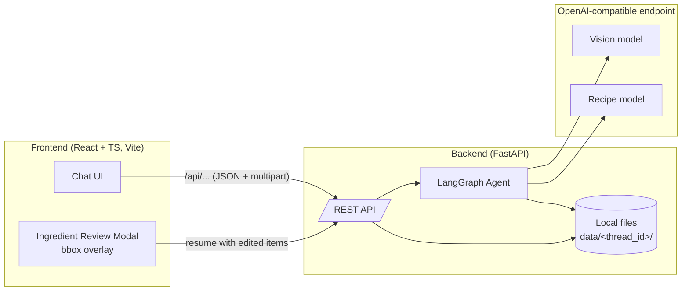
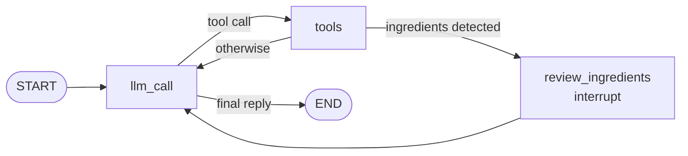
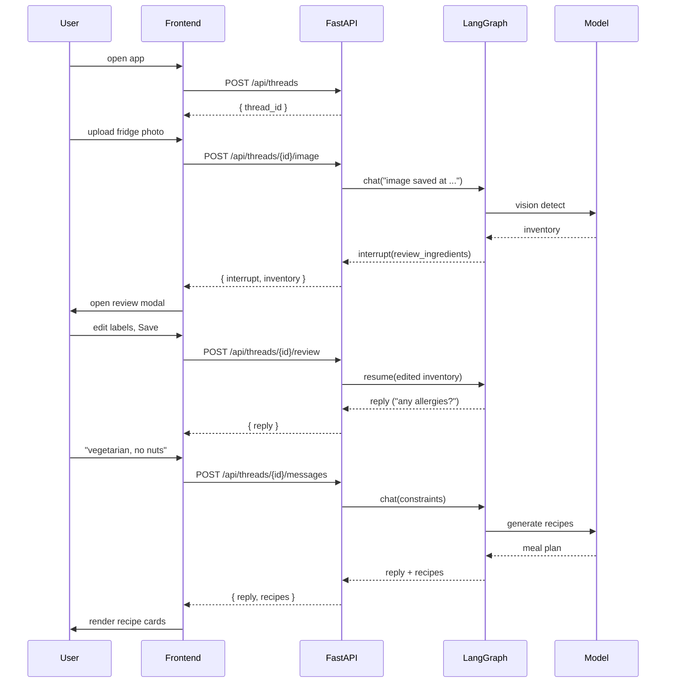

# Kitchen Copilot — Architecture Overview

This document explains how the **backend** (Python / FastAPI + LangGraph) and the
**frontend** (React + TypeScript) work and how they interact, followed by a set of
suggested design improvements.

---

## 1. High-level picture



The system is a **conversational agent**: the user chats, uploads a fridge photo,
reviews the detected ingredients, and receives recipes. All of it flows through one
LangGraph state machine keyed by a `thread_id`.

---

## 2. Backend

### 2.1 Module layout (`kitchen/`)

| File | Responsibility |
| ---- | -------------- |
| `schemas.py` | Pydantic models + `Classification` enum (single source of truth). |
| `config.py` | Loads env vars, builds the cached OpenAI client, sets `DATA_DIR`. |
| `services.py` | Pure AI calls: `detect_inventory` (vision) and `generate_meal_plan` (recipes). |
| `persistence.py` | Local per-thread file storage (image, inventory, recipes). |
| `agent.py` | The LangGraph state graph, tools, interrupt, and the convenience API. |
| `server.py` | FastAPI app exposing the agent over HTTP + serving the built frontend. |

### 2.2 The agent graph



- **`llm_call`** — the reasoning node. It runs the chat model with two bound tools and
  a system prompt describing the workflow.
- **Tools the model can call**
  - `identify_ingredients(image_path)` → runs the vision model, saves `inventory.json`,
    sets `pending_review = True`, and returns a `Command` updating graph state.
  - `generate_recipes(allergies, dietary_preferences, skill_level, mode)` → reads the
    reviewed inventory from state (via `InjectedState`), runs the recipe model, saves
    `recipes.json`.
- **`review_ingredients`** — a human-in-the-loop node. It calls `interrupt(...)`, which
  **pauses the whole graph** and surfaces the detected inventory to the caller. When the
  caller resumes with `Command(resume=<edited inventory>)`, that value replaces the
  inventory and the graph continues.
- **State** (`KitchenState`) carries `messages`, `thread_id`, `inventory`, `recipes`,
  `image_path`, and `pending_review`.
- **Checkpointer** — an `InMemorySaver` persists state per `thread_id`, which is what
  makes multi-turn conversation (and pause/resume) possible.

### 2.3 Convenience API (used by the server)

`agent.py` wraps the graph in three functions so the HTTP layer stays thin:

- `new_thread_id()` — fresh UUID.
- `chat(thread_id, message)` — invoke with a user message.
- `resume_review(thread_id, edited_inventory)` — resume a paused thread.

Each returns a normalized dict: `{ thread_id, reply, interrupt, inventory, recipes }`.
`_message_text()` flattens the Responses-API content blocks
(`[{"type":"text","text":"..."}]`) into a plain string for `reply`.

### 2.4 REST API (`server.py`)

| Method | Path | Purpose |
| ------ | ---- | ------- |
| POST | `/api/threads` | Create a conversation thread |
| POST | `/api/threads/{id}/image` | Upload a fridge image (multipart), kick off detection |
| POST | `/api/threads/{id}/messages` | Send a chat message |
| POST | `/api/threads/{id}/review` | Resume after editing ingredients |
| GET | `/api/threads/{id}/inventory` | Load persisted inventory |
| GET | `/api/threads/{id}/recipes` | Load persisted recipes |
| GET | `/api/threads/{id}/image` | Fetch the uploaded fridge image |

In production the app also serves the Vite `dist/` build at `/`.

### 2.5 Persistence

Artifacts are written under `data/<thread_id>/`:

```
data/<thread_id>/fridge.<ext>     uploaded image
data/<thread_id>/inventory.json   detected / edited ingredients
data/<thread_id>/recipes.json     generated meal plan
```

`thread_id` is sanitized before use to prevent path traversal. This is a deliberate
placeholder for cloud/object storage later.

---

## 3. Frontend

### 3.1 Structure (`frontend/src/`)

| File | Responsibility |
| ---- | -------------- |
| `types.ts` | TypeScript mirrors of the backend schemas + classification colors. |
| `api.ts` | Thin `fetch` wrapper for each endpoint. |
| `App.tsx` | Owns all state: thread id, chat messages, review modal, busy flag. |
| `components/Composer.tsx` | Text input + 📷 upload button. |
| `components/ChatBubble.tsx` | Renders a text / image / recipes message. |
| `components/ReviewModal.tsx` | Image with editable bounding-box labels + item list. |
| `components/RecipeCards.tsx` | Recipe, snack, and shopping-list rendering. |
| `styles.css` | Dark, single-file theme. |

### 3.2 State model

`App.tsx` keeps an array of `ChatMessage` (a discriminated union of `text`, `image`,
and `recipes` kinds). Every server response is funneled through `applyResponse()`,
which:

1. appends the assistant's `reply` (if any),
2. appends a recipe-cards message when `recipes` is present,
3. opens the review modal when an `interrupt` of type `review_ingredients` arrives.

### 3.3 The bounding-box review modal

- The uploaded image is shown from a local object URL (instant, no round-trip).
- Each detected item with a `bbox` is drawn as a dashed rectangle positioned from the
  model's **normalized** coordinates (`x_min…y_max` → CSS `%`).
- Labels are **editable inputs** placed over each box (with slight jitter so they sit
  "loosely dotted" around the region). Box fills use `pointer-events: none` so
  overlapping/nested regions never swallow each other's labels.
- Editing a label or a list row updates the same `items` state; "Save & continue"
  resumes the graph with the edited inventory, "Skip edits" resumes as-is.

### 3.4 Dev vs. prod wiring

- **Dev:** `npm run dev` serves the app on `:5173`; Vite proxies `/api/*` to the
  backend on `:8000` (no CORS friction, relative URLs everywhere).
- **Prod:** `npm run build` emits `frontend/dist`, which FastAPI serves directly.

---

## 4. End-to-end flow



---

## 5. Suggested design improvements

**Reliability & correctness**
- **Durable checkpointing.** Swap `InMemorySaver` for `SqliteSaver`/`PostgresSaver` so
  conversations and paused interrupts survive a server restart.
- **Validate resume payloads.** The `/review` endpoint currently trusts the client's
  inventory shape; validate it against a Pydantic model before resuming.
- **Idempotency / concurrency.** Guard against two requests resuming the same thread
  simultaneously (e.g. a per-thread lock or optimistic version check).

**Architecture & scale**
- **Streaming responses.** Use `graph.stream()` + SSE/WebSocket so the UI shows tokens
  and tool progress live instead of waiting for the full turn.
- **Cloud storage.** Replace the local `data/` folder with blob storage (e.g. Azure Blob
  / S3); `persistence.py` is already the single seam to change.
- **Background jobs.** Vision + recipe calls are slow; move them to a task queue and
  have the frontend poll or subscribe, so HTTP requests don't block.
- **Stateless workers.** With durable checkpoints + object storage, the API can scale
  horizontally behind a load balancer.

**Security & ops**
- **AuthN/AuthZ.** Tie `thread_id`s to authenticated users so one user can't read
  another's threads or images. Tighten CORS from `*` to known origins.
- **Upload limits.** Enforce max image size, content-type sniffing, and virus/size
  checks on `/image`.
- **Observability.** Add structured logging, request tracing, and LangGraph run traces
  (e.g. LangSmith) to debug tool calls and latency.
- **Config hardening.** Fail fast on missing env vars at startup instead of at first call.

**Product & UX**
- **Bounding-box editing.** Let users drag/resize boxes and add new ones, not just edit
  labels — persist the adjusted geometry back to the inventory.
- **Persist chat history to the UI.** Rehydrate messages from the backend on reload
  (currently the transcript lives only in React state).
- **Recipe interactions.** "Regenerate", "make it vegan", save/favorite, and shopping
  list export.
- **Optimistic UI + error toasts.** Replace inline error bubbles with clearer retry
  affordances and distinct failure states.

**Code quality**
- **Shared schema generation.** Generate `types.ts` from the Pydantic models (e.g. via
  OpenAPI) so the frontend and backend can't drift.
- **Tests.** Unit-test `services`/`persistence`, and add a graph test that mocks the
  model to exercise the identify → interrupt → resume → recipes path.
