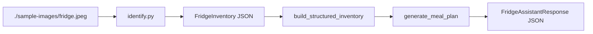

# Kitchen Copilot

This project has two explicit data-flow stages:

1. `identify.py` converts a fridge image into structured inventory data.
2. `generate.py` converts that inventory data, plus user constraints, into meal suggestions.

## End-to-End Data Flow



## Stage 1: Image To Inventory

`identify.py` reads the image at `./sample-images/fridge.jpeg`, base64-encodes it, and submits it to the OpenAI vision model.

The model response is parsed with this schema:

- `FridgeInventory`
	- `items: list[FridgeItem]`

- `FridgeItem`
	- `name: str`
	- `classification: Classification`
	- `confidence: float`
	- `bbox: BoundingBox | None`

- `BoundingBox`
	- `x_min: float`
	- `y_min: float`
	- `x_max: float`
	- `y_max: float`

The `Classification` enum is:

- `fruit`
- `vegetable`
- `herb`
- `dairy`
- `cheese`
- `eggs`
- `meat`
- `seafood`
- `plant_protein`
- `condiment`
- `sauce`
- `grain`
- `bread`
- `prepared_food`
- `beverage`
- `dessert`
- `other`

The output is written to `<deployment_name>_fridge_inventory.json`, for example `gpt-5.4-mini_fridge_inventory.json`.

## Stage 2: Inventory To Meal Plan

`generate.py` loads the saved inventory JSON and first normalizes it with `build_structured_inventory(detection_json)`, which groups item names by classification without renaming the items.

The generation function signature is:

```python
generate_meal_plan(inventory, allergies, dietary_preferences, skill_level, mode)
```

Inputs passed into the model prompt are:

- `inventory`: the grouped fridge inventory
- `allergies`: user allergy constraints
- `dietary_preferences`: diet preference string
- `skill_level`: cooking skill level
- `mode`: the meal goal or usage context

The response is parsed with this schema:

- `FridgeAssistantResponse`
	- `recipes: List[Recipe]`
	- `quick_snack_ideas: List[str]`
	- `missing_common_items: List[str]`

- `Recipe`
	- `name: str`
	- `intro: str`
	- `ingredients: List[Ingredient]`
	- `missing_ingredients: List[str]`
	- `steps: List[str]`
	- `time_minutes: int`
	- `difficulty: str`
	- `nutrition: Optional[Nutrition]`
	- `dietary_tags: List[str]`
	- `flavor_profile: List[str]`

- `Ingredient`
	- `name: str`
	- `amount: Optional[str]`
	- `optional: bool`
	- `note: Optional[str]`

- `Nutrition`
	- `calories: Optional[int]`
	- `protein_g: Optional[float]`
	- `carbs_g: Optional[float]`
	- `fat_g: Optional[float]`

## Prompt Constraints

The recipe generation step is constrained to:

- use only detected inventory items plus basic pantry staples: salt, pepper, oil, and water
- preserve item names exactly as detected
- respect allergies and dietary restrictions
- avoid inventing ingredients
- keep output aligned to the declared schema

## Files

- `identify.py`: image-to-inventory extraction
- `generate.py`: inventory-to-recipe generation
- `sample-images/`: input image examples
- `gpt-5.4-mini_fridge_inventory.json`: example inventory output
- `fridge_meal_plan.json`: example meal-plan output

## Requirements

Install the Python dependencies listed in `requirements.txt`.

Set these environment variables in a `.env` file:

- `OPENAI_ENDPOINT`
- `OPENAI_DEPLOYMENT_NAME`
- `OPENAI_API_KEY`

## Usage

```bash
python identify.py
python generate.py
```
