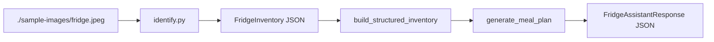
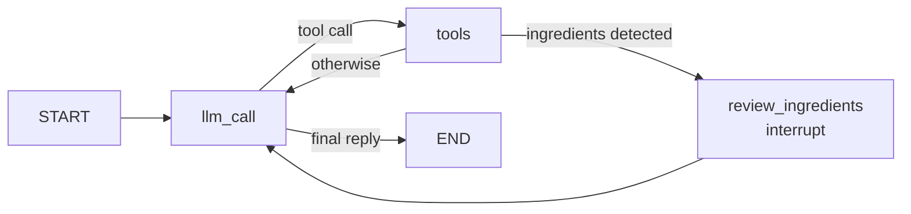

# Kitchen Copilot

This project has two explicit data-flow stages:

1. `identify.py` converts a fridge image into structured inventory data.
2. `generate.py` converts that inventory data, plus user constraints, into meal suggestions.

## End-to-End Data Flow



## Stage 1: Image To Inventory

`identify.py` reads the image at `./sample-images/fridge.jpeg`, base64-encodes it, and submits it to the OpenAI vision model.

The model response is parsed with this schema:

- `FridgeInventory`
	- `items: list[FridgeItem]`

- `FridgeItem`
	- `name: str`
	- `classification: Classification`
	- `confidence: float`
	- `bbox: BoundingBox | None`

- `BoundingBox`
	- `x_min: float`
	- `y_min: float`
	- `x_max: float`
	- `y_max: float`

The `Classification` enum is:

- `fruit`
- `vegetable`
- `herb`
- `dairy`
- `cheese`
- `eggs`
- `meat`
- `seafood`
- `plant_protein`
- `condiment`
- `sauce`
- `grain`
- `bread`
- `prepared_food`
- `beverage`
- `dessert`
- `other`

The output is written to `<deployment_name>_fridge_inventory.json`, for example `gpt-5.4-mini_fridge_inventory.json`.

## Stage 2: Inventory To Meal Plan

`generate.py` loads the saved inventory JSON and first normalizes it with `build_structured_inventory(detection_json)`, which groups item names by classification without renaming the items.

The generation function signature is:

```python
generate_meal_plan(inventory, allergies, dietary_preferences, skill_level, mode)
```

Inputs passed into the model prompt are:

- `inventory`: the grouped fridge inventory
- `allergies`: user allergy constraints
- `dietary_preferences`: diet preference string
- `skill_level`: cooking skill level
- `mode`: the meal goal or usage context

The response is parsed with this schema:

- `FridgeAssistantResponse`
	- `recipes: List[Recipe]`
	- `quick_snack_ideas: List[str]`
	- `missing_common_items: List[str]`

- `Recipe`
	- `name: str`
	- `intro: str`
	- `ingredients: List[Ingredient]`
	- `missing_ingredients: List[str]`
	- `steps: List[str]`
	- `time_minutes: int`
	- `difficulty: str`
	- `nutrition: Optional[Nutrition]`
	- `dietary_tags: List[str]`
	- `flavor_profile: List[str]`

- `Ingredient`
	- `name: str`
	- `amount: Optional[str]`
	- `optional: bool`
	- `note: Optional[str]`

- `Nutrition`
	- `calories: Optional[int]`
	- `protein_g: Optional[float]`
	- `carbs_g: Optional[float]`
	- `fat_g: Optional[float]`

## Prompt Constraints

The recipe generation step is constrained to:

- use only detected inventory items plus basic pantry staples: salt, pepper, oil, and water
- preserve item names exactly as detected
- respect allergies and dietary restrictions
- avoid inventing ingredients
- keep output aligned to the declared schema

## Files

- `identify.py`: image-to-inventory extraction
- `generate.py`: inventory-to-recipe generation
- `sample-images/`: input image examples
- `gpt-5.4-mini_fridge_inventory.json`: example inventory output
- `fridge_meal_plan.json`: example meal-plan output

## Requirements

Install the Python dependencies listed in `requirements.txt`.

Set these environment variables in a `.env` file:

- `OPENAI_ENDPOINT`
- `OPENAI_DEPLOYMENT_NAME`
- `OPENAI_API_KEY`

## Usage

Run the two stages as standalone scripts:

```bash
python identify.py
python generate.py
```

## Conversational Agent (LangGraph)

The `kitchen/` package wraps both stages into a single LangGraph agent that a
frontend can drive over HTTP, keeping conversation state per `thread_id`.

### Architecture



- **Tools the LLM can call**
	- `identify_ingredients(image_path)` — runs the vision model, saves the inventory.
	- `generate_recipes(allergies, dietary_preferences, skill_level, mode)` — runs the
	  recipe model on the reviewed inventory. All constraints are optional.
- **Human-in-the-loop** — after ingredients are detected, the graph pauses at
  `review_ingredients` via `interrupt()` so the user can edit the list before recipes
  are generated.
- **Persistence** — an in-memory checkpointer keeps per-`thread_id` conversation state,
  and artifacts are written to `data/<thread_id>/`:
	- `fridge.<ext>` — uploaded image
	- `inventory.json` — detected / edited ingredients
	- `recipes.json` — generated meal plan

### Package layout

- `kitchen/schemas.py` — shared pydantic models and the `Classification` enum
- `kitchen/services.py` — vision inventory detection + recipe generation
- `kitchen/persistence.py` — local per-thread file storage
- `kitchen/agent.py` — the LangGraph state graph, tools, and interrupt
- `kitchen/server.py` — FastAPI backend
- `frontend/` — Vite + React + TypeScript single-page client

### Run the backend

```bash
python -m uvicorn kitchen.server:app --reload
```

The first request takes a few seconds while `langchain` / `langgraph` import; once
you see `Uvicorn running on http://127.0.0.1:8000` it is ready.

### Run the frontend (dev)

```bash
cd frontend
npm install
npm run dev      # http://127.0.0.1:5173 (proxies /api to the backend on :8000)
```

For a production bundle, `npm run build` emits `frontend/dist`, which the backend
then serves at http://127.0.0.1:8000.

### API

| Method | Path | Purpose |
| ------ | ---- | ------- |
| POST | `/api/threads` | Create a new conversation thread |
| POST | `/api/threads/{thread_id}/image` | Upload a fridge image (multipart) |
| POST | `/api/threads/{thread_id}/messages` | Send a chat message |
| POST | `/api/threads/{thread_id}/review` | Resume after editing ingredients |
| GET | `/api/threads/{thread_id}/inventory` | Load persisted inventory |
| GET | `/api/threads/{thread_id}/recipes` | Load persisted recipes |
| GET | `/api/threads/{thread_id}/image` | Fetch the uploaded fridge image |

### Typical flow

1. `POST /api/threads` → get a `thread_id`.
2. `POST /api/threads/{thread_id}/image` → the response contains an `interrupt` with
   the detected inventory.
3. `POST /api/threads/{thread_id}/review` with the edited `{ "inventory": {...} }`
   (or `null` to accept as-is) → the agent asks about allergies / diet / skill / goal.
4. `POST /api/threads/{thread_id}/messages` with those constraints → the response
   contains the generated `recipes`.
