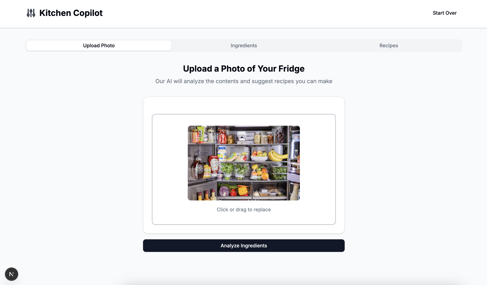
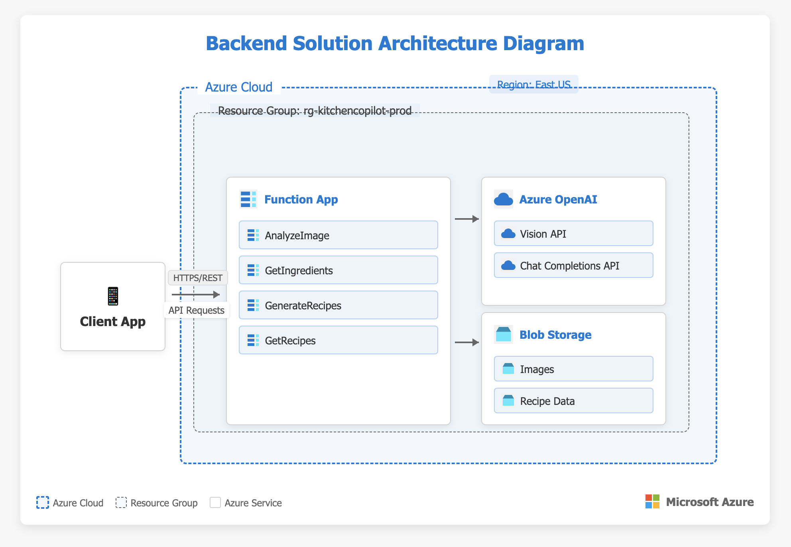
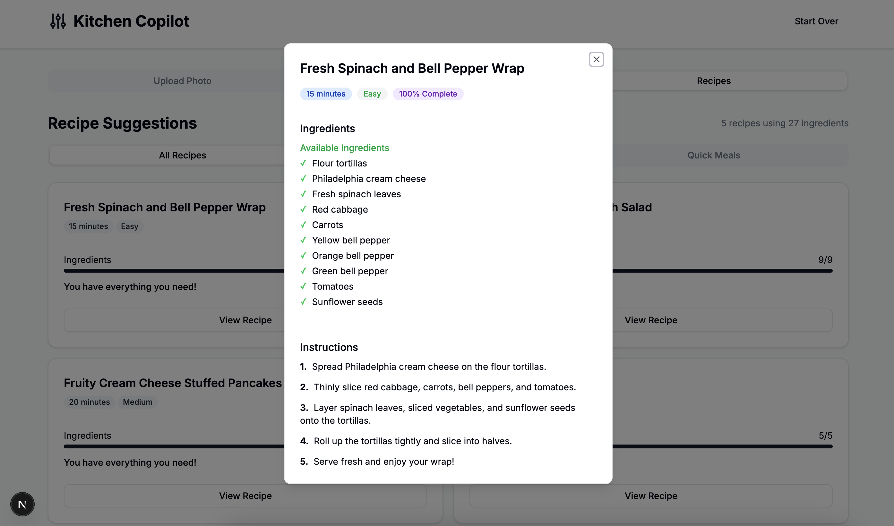
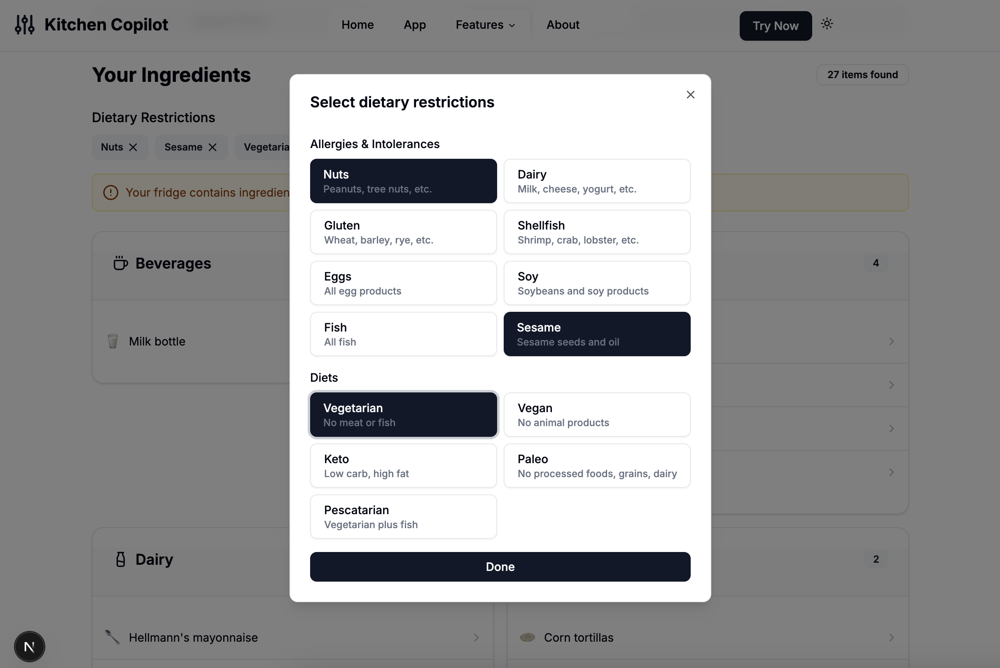

# Kitchen Copilot - Backend API

An Azure Function App that leverages computer vision to identify food items from refrigerator images and generates personalised recipe recommendations based on the detected ingredients and dietary preferences.



## Features
- **Image Analysis**: Analyze photos of fridges or food items to identify ingredients
- **Recipe Generation**: Get customized recipe suggestions based on identified ingredients
- **Dietary Restrictions**: Specify allergies or dietary preferences for personalized recipes
- **Cloud Storage**: All data is stored in Azure Blob Storage for reliability and scalability



## Requirements
- Python 3.8+
- Azure Functions Core Tools
- Azure OpenAI API access with a deployed GPT-4 Vision model
- Azure Blob Storage account

## Setup

### Backend Setup
1. Clone the repository
2. Navigate to the project root
3. Install Python dependencies:
   ```bash
   pip install -r requirements.txt
   ```
4. Create a `local.settings.json` file with your configuration details:
   ```json
   {
     "IsEncrypted": false,
     "Values": {
       "FUNCTIONS_WORKER_RUNTIME": "python",
       "AzureWebJobsStorage": "UseDevelopmentStorage=true",
       
       "AZURE_OPENAI_API_KEY": "your_azure_openai_api_key",
       "AZURE_OPENAI_ENDPOINT": "https://your-resource-name.openai.azure.com",
       "API_VERSION": "2023-12-01-preview",
       "MODEL_NAME": "your-gpt4-vision-deployed-model-name",
       
       "AZURE_STORAGE_CONNECTION_STRING": "your_azure_storage_connection_string",
       "AZURE_STORAGE_CONTAINER": "container01"
     }
   }
   ```

## Usage

### Running Locally
1. Start the Azure Functions runtime:
   ```bash
   func start
   ```

2. The API will be available at `http://localhost:7071/kitchen-copilot-api/`

### Deploying to Azure
1. Create an Azure Function App in the Azure Portal
2. Deploy using Azure Functions Core Tools:
   ```bash
   func azure functionapp publish YOUR_FUNCTION_APP_NAME
   ```

### Connecting to a Frontend Application
This backend API can be connected to a separate frontend repository. In your frontend project:

1. Create a `.env.local` file with:
   ```
   NEXT_PUBLIC_API_URL=https://your-function-app.azurewebsites.net/kitchen-copilot-api
   NEXT_PUBLIC_API_KEY=your_function_app_key
   ```

2. Use these environment variables in your API client to make authenticated requests

#### API Endpoints
- `POST /analyze-image`: Upload and analyze a fridge image
- `GET /ingredients`: Get ingredients from an analysis
- `POST /generate-recipes`: Generate recipe suggestions based on available ingredients and dietary restrictions
- `GET /recipes`: Get previously generated recipes

## Using Postman with the API

You can test the API endpoints using Postman. Here's how to make requests to each endpoint:

### 1. Analyze Image Endpoint (POST /analyze-image)

1. Open Postman and create a new POST request to `http://localhost:7071/kitchen-copilot-api/analyze-image`
2. Add an authorization header:
   - Key: `x-functions-key`
   - Value: `your_function_key` (or use the master key for local development)
3. In the request builder, select the "Body" tab
4. Select "form-data"
5. Add a key named "file" and change the type from "Text" to "File"
6. Click "Select Files" and choose an image of your refrigerator
7. Click "Send" to submit the request

Example response:
```json
{
  "status": "complete",
  "result": {
    "ingredients": {
      "Dairy": ["milk", "cheddar cheese", "yogurt"],
      "Produce": ["carrots", "lettuce", "tomatoes", "onions"],
      "Proteins": ["chicken breast", "eggs"],
      "Condiments": ["ketchup", "mayonnaise", "mustard"]
    }
  },
  "summary": {
    "total_count": 10,
    "categories": 4,
    "by_category": {
      "Dairy": 3,
      "Produce": 4,
      "Proteins": 2,
      "Condiments": 3
    }
  },
  "image_filename": "image_1743074276_5115e30c.jpg",
  "request_id": "fridge_1743074276_5115e30c"
}
```

### 2. Get Ingredients Endpoint (GET /ingredients)


1. Create a new GET request to `http://localhost:7071/kitchen-copilot-api/ingredients?request_id=fridge_1743074276_5115e30c`
2. Add the `x-functions-key` header as described above
3. The request_id query parameter is required to get ingredients from a specific analysis
4. Click "Send" to submit the request

Example response:
```json
{
  "ingredients": {
    "Dairy": ["milk", "cheddar cheese", "yogurt"],
    "Produce": ["carrots", "lettuce", "tomatoes", "onions"],
    "Proteins": ["chicken breast", "eggs"],
    "Condiments": ["ketchup", "mayonnaise", "mustard"]
  }
}
```

### 3. Get Recipes Endpoint (GET /recipes)



1. Create a new GET request to `http://localhost:7071/kitchen-copilot-api/recipes?request_id=fridge_1743074276_5115e30c`
2. Add the `x-functions-key` header as described above
3. The request_id query parameter is required to get recipes from a specific analysis
4. Click "Send" to submit the request

Example response:
```json
{
  "items": [
    {
      "name": "Quick Chicken Salad",
      "total_ingredients": ["chicken breast", "lettuce", "tomatoes", "onions", "mayonnaise", "salt", "pepper"],
      "available_ingredients": ["chicken breast", "lettuce", "tomatoes", "onions", "mayonnaise"],
      "missing_ingredients": ["salt", "pepper"],
      "completeness_score": 71,
      "instructions": ["Step 1...", "Step 2..."],
      "cooking_time": "15 minutes",
      "difficulty": "Easy"
    }
  ],
  "analysis": [
    {
      "recipe_name": "Quick Chicken Salad",
      "completeness": 71,
      "available_count": 5,
      "missing_count": 2,
      "total_ingredients": 7,
      "cooking_time": "15 minutes",
      "difficulty": "Easy"
    }
  ],
  "ingredient_count": 10,
  "dietary_restrictions": []
}
```

### 4. Generate Recipes Endpoint (POST /generate-recipes)

1. Create a new POST request to `http://localhost:7071/kitchen-copilot-api/generate-recipes`
2. Add the `x-functions-key` header as described above
3. In the request builder, select the "Body" tab
4. Select "raw" and choose "JSON" from the dropdown
5. Enter the request body:
   ```json
   {
     "num_recipes": 5,
     "request_id": "fridge_1743074276_5115e30c",
     "dietary_restrictions": [
       {
         "id": "vegetarian",
         "name": "Vegetarian"
       },
       {
         "id": "nuts",
         "name": "Nuts"
       }
     ]
   }
   ```
   - The request_id is required and should be from a previous image analysis
   - The "dietary_restrictions" field is optional and can include multiple restrictions
6. Click "Send" to submit the request

Example response:
```json
{
  "items": [
    {
      "name": "Vegetarian Mediterranean Wrap",
      "total_ingredients": ["tortillas", "lettuce", "tomatoes", "onions", "mayonnaise", "yogurt", "salt", "pepper"],
      "available_ingredients": ["tortillas", "lettuce", "tomatoes", "onions", "mayonnaise", "yogurt"],
      "missing_ingredients": ["salt", "pepper"],
      "completeness_score": 75,
      "instructions": ["Step 1...", "Step 2..."],
      "cooking_time": "15 minutes",
      "difficulty": "Easy"
    }
  ],
  "analysis": [
    {
      "recipe_name": "Vegetarian Mediterranean Wrap",
      "completeness": 75,
      "available_count": 6,
      "missing_count": 2,
      "total_ingredients": 8,
      "cooking_time": "15 minutes",
      "difficulty": "Easy"
    }
  ],
  "ingredient_count": 10,
  "dietary_restrictions": [
    {
      "id": "vegetarian",
      "name": "Vegetarian"
    },
    {
      "id": "nuts",
      "name": "Nuts"
    }
  ]
}
```

## Dietary Restrictions Feature

The Kitchen Copilot API supports the following dietary restrictions:



### Available Restrictions

#### Allergies & Intolerances
- Nuts (peanuts, tree nuts)
- Dairy (milk, cheese, yogurt)
- Gluten (wheat, barley, rye)
- Shellfish (shrimp, crab, lobster)
- Eggs
- Soy
- Fish
- Sesame

#### Diets
- Vegetarian (no meat or fish)
- Vegan (no animal products)
- Keto (low carb, high fat)
- Paleo (no processed foods, grains, dairy)
- Pescatarian (vegetarian plus fish)

## Project Structure
```
kitchen-copilot-backend/
├── AnalyzeImage/                                        # Image analysis function
│   ├── __init__.py                                      # Function entry point
│   └── function.json                                    # Function configuration
├── GenerateRecipes/                                     # Recipe generation function
│   ├── __init__.py                                      # Function entry point
│   └── function.json                                    # Function configuration
├── GetIngredients/                                      # Get ingredients function
│   ├── __init__.py                                      # Function entry point
│   └── function.json                                    # Function configuration
├── GetRecipes/                                          # Get recipes function
│   ├── __init__.py                                      # Function entry point
│   └── function.json                                    # Function configuration
├── assets/                                              # Documentation assets
├── sample-images/                                       # Sample test images
├── shared_code/                                         # Shared code modules
│   ├── __init__.py                                      # Module initialization
│   ├── config.py                                        # Configuration utilities
│   ├── models/                                          # Data models
│   │   ├── __init__.py
│   │   ├── ingredients.py                               # Ingredients data model
│   │   └── recipes.py                                   # Recipes data model
│   ├── prompts/                                         # Prompt templates
│   │   ├── __init__.py
│   │   ├── recipe_prompt.py                             # Recipe generation prompt
│   │   └── vision_prompt.py                             # Image analysis prompt
│   ├── services/                                        # Core services
│   │   ├── __init__.py
│   │   ├── azure_blob_service.py                        # Azure Blob Storage service
│   │   ├── azure_openai_client.py                       # Azure OpenAI API client
│   │   ├── recipe_service.py                            # Recipe generation service
│   │   └── vision_service.py                            # Image analysis service
│   └── utils/                                           # Utility functions
│       ├── __init__.py
│       └── image_utils.py                               # Image handling utilities
├── host.json                                            # Azure Functions host configuration
├── local.settings.json                                  # Local settings (not in repo)
├── requirements.in                                      # Primary dependencies
└── requirements.txt                                     # Pinned dependencies
```

## Troubleshooting

### API Connection Issues
- Verify that the Azure Functions app is running on the correct host and port
- Check that your function authorization level and keys are correctly set up
- For CORS issues, ensure your Function App has CORS properly configured in the Azure Portal
- Verify your connection strings and API keys in the application settings