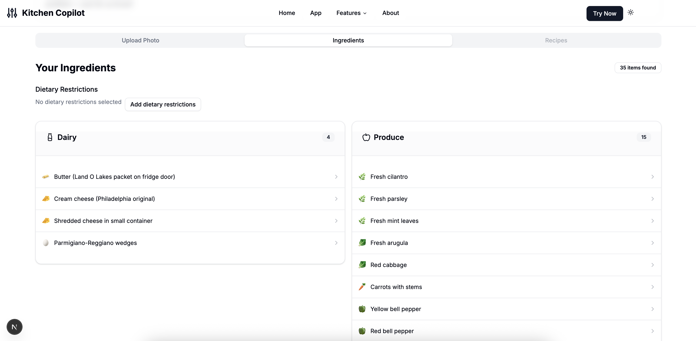

# Kitchen Copilot Frontend

A sleek Next.js web application that uses AI to analyze your refrigerator contents from photos and generate smart, personalized recipes based on what you have — factoring in your dietary needs, allergens, missing ingredients, and cooking preferences.

## 🧠 What It Does

### 1. Image Upload  
Snap or upload a photo of your fridge. Our AI scans the photo to detect individual ingredients with impressive accuracy.

<p align="center">
  
</p>

### 2. Ingredient Detection  
Instantly see a list of recognized ingredients. You can also manually edit or add missing ones.

<p align="center">
  
</p>

### 3. Set Allergens & Dietary Preferences  
Filter out ingredients that conflict with dietary restrictions like gluten-free, vegan, or specific allergens such as nuts or dairy.

<p align="center">
  
</p>

### 4. Smart Recipe Suggestions  
Based on what’s in your fridge (and what’s not), the app flags incompatible items and generates curated recipe ideas, factoring in:

- Cooking time  
- Difficulty level  
- Ingredients you’re missing

<p align="center">
  
</p>

## ✨ Key Features

- 📸 **Photo-based ingredient recognition**  
- 🍽️ **Tailored recipe recommendations**  
- ⚠️ **Allergen detection and dietary filters**  
- 🕒 **Smart sorting by prep time, difficulty, and availability**  
- 🌓 **Responsive UI with dark/light mode**

## 🛠 Tech Stack

- **Framework:** Next.js 15, React 19  
- **Language:** TypeScript  
- **Styling:** Tailwind CSS  
- **UI Components:** [shadcn/ui](https://ui.shadcn.com)  
- **Animations:** Framer Motion  

## 🚀 Getting Started

### Prerequisites

- Node.js 18.0 or later
- npm or yarn

### Installation

```bash
git clone https://github.com/yourusername/kitchen-copilot-frontend.git
cd kitchen-copilot-frontend
npm install
```

### Configure Environment Variables
Create a `.env.local` file in the root directory with the following variables:

```
NEXT_PUBLIC_API_URL=your_api_url_here
NEXT_PUBLIC_FUNCTION_KEY=your_function_key_here
```

### Run the App

```bash
npm run dev
# or
yarn dev
```

5. Open [http://localhost:3000](http://localhost:3000) in your browser to see the application.

## 📁 Project Structure

- `/src/app` - Next.js app router pages
- `/src/components` - React components
  - `/src/components/ui` - shadcn/ui components
  - `/src/components/kitchen` - Custom components for the application
- `/src/lib` - Utility functions and API client
- `/src/types` - TypeScript type definitions

## 📜 Scripts

- `npm run dev` - Start the development server
- `npm run build` - Build the application for production
- `npm start` - Start the production server
- `npm run lint` - Run ESLint

## 📄 License

This project is licensed under the MIT License.
